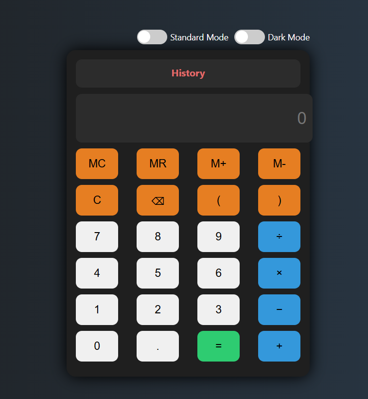

# 🔢 Scientific Calculator

A modern **Scientific Calculator** built with **HTML, CSS, and JavaScript**.  
It supports both **Standard** and **Scientific** modes, has a **dark/light theme toggle**, **memory functions**, **calculation history**, and full **keyboard support**.

---

## ✨ Features

✅ **Standard Mode** – Basic arithmetic (+, −, ×, ÷, %, ^, parentheses).  
✅ **Scientific Mode** – Advanced functions:  
   - Square, Cube, Square Root  
   - Factorial (!), Exponential (exp), Logarithm (log)  
   - Trigonometric (sin, cos, tan) and Inverse (asin, acos, atan)  
   - Hyperbolic (sinh, cosh, tanh)  
   - Constants like π (Pi)  
✅ **Memory Functions** – `MC`, `MR`, `M+`, `M-`.  
✅ **History Panel** – Stores past calculations, click to reuse results.  
✅ **Dark/Light Theme** – Switchable via toggle.  
✅ **Keyboard Support** –  
   - Numbers (`0-9`), Decimal (`.`)  
   - Operators (`+`, `-`, `*`, `/`, `^`)  
   - Parentheses (`(`, `)`)  
   - `Enter` → Calculate  
   - `Backspace` → Delete last  
   - `Escape` → Clear display  

---

## 🖼️ Preview

  
*(Add your screenshot here once you run the project)*

---

## 📂 Project Structure

